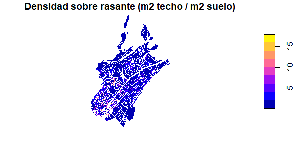
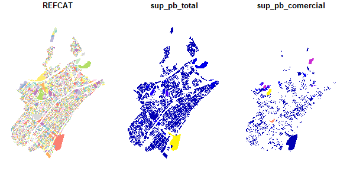
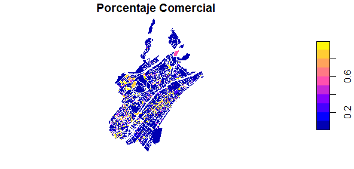
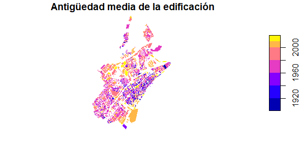

# UrbanAnalysis
<h2>Territorial Analysis Practice with R for the EET (Estudis Estratègics del Territori) module of the MSc in GIS Technologies and Applications (Universitat Politècnica de Catalunya)</h2>

This project is based upon on the skills and practice acquired through the Territorial Strategic Studies Module. The objective was to calculate two urban indices related to plots and buildings of the municipality of Badalona (Barcelona, Spain) using the open data for the cadastre.

With this project the underlying aim was to fully understand and to work out the process of data statistic analysis in R for urban studies: 

<ul>
  <li>Environment configuration</li>
  <li>Loading necessary R packages</li>
  <li>Data upload</li>
    <ol>
      <li>Cadastral data</li>
      <li>Spatial data / Cartography</li>
    </ol>
  <li>Data formatting and cleansing</li>
  <li>Operations related to Plot Indexes (6) (cadastral type 11 - Buildings), involving surface area, built area, above ground level built area, below ground area built area, and covered area.</li> 
    
    
  <li>Operations related to ground floor commercial premises (Planta baja): Total ground floor area, total ground floor commercial area, business potential</li> 
    
     
    
  <li>Operations related to the average antiquity of buildings</li> 
    
  

  
